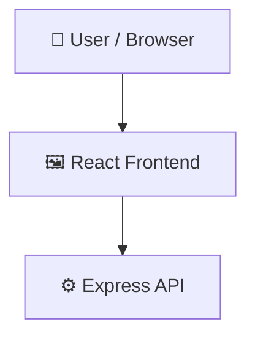

# question-paper-generator

        

## 📑 Table of Contents

- [Description](#description)
- [Screenshots](#screenshots)
- [Tech Stack](#tech-stack)
- [Architecture](#architecture)
- [Quick Start](#quick-start)
- [Environment Variables](#environment-variables)
- [Key Dependencies](#key-dependencies)
- [Available Scripts](#available-scripts)
- [Project Structure](#project-structure)
- [Development Setup](#development-setup)
- [Contributors](#contributors)
- [Contributing](#contributing)

## 📝 Description

question-paper-generator — a backend api built with Express.js, React, Tailwind CSS, TypeScript, Vite.

## 📸 Screenshots


## 🛠️ Tech Stack

- 🚀 **Express.js**
- ⚛️ **React**
- 🌬️ **Tailwind CSS**
- 📘 **TypeScript**
- ⚡ **Vite**

## 🏗️ Architecture

A high-level view of how the main pieces fit together:



## ⚡ Quick Start

```bash

# 1. Clone the repository
git clone https://github.com/VenkataRatnamOleti/question-paper-generator.git

# 2. Install dependencies
npm install

# 3. Configure environment
cp .env.example .env   # then fill in the values

# 4. Start the dev server
npm run dev
```

## 🔑 Environment Variables

The following environment variables are required (see `.env.example`):

```bash
GEMINI_API_KEY=
APP_URL=
```

## 📦 Key Dependencies

```
@google/genai: ^2.4.0
@tailwindcss/vite: ^4.1.14
@vitejs/plugin-react: ^5.0.4
lucide-react: ^0.546.0
react: ^19.0.1
react-dom: ^19.0.1
vite: ^6.2.3
express: ^4.21.2
dotenv: ^17.2.3
motion: ^12.23.24
```

## 🚀 Available Scripts

- **dev** — `npm run dev`
- **build** — `npm run build`
- **preview** — `npm run preview`
- **clean** — `npm run clean`
- **lint** — `npm run lint`

## 📁 Project Structure

```
.
├── .env.example
├── index.html
├── metadata.json
├── package.json
├── src
│   ├── App.tsx
│   ├── assets
│   │   └── images
│   │       ├── dashboard_mockup_1782110592523.jpg
│   │       ├── exam_mockup_1782110627845.jpg
│   │       └── parameters_mockup_1782110611628.jpg
│   ├── components
│   │   ├── AppSimulator.tsx
│   │   └── NetworkBackground.tsx
│   ├── index.css
│   ├── main.tsx
│   └── sections
│       ├── About.tsx
│       ├── Features.tsx
│       ├── Footer.tsx
│       ├── Hero.tsx
│       ├── LiveDemo.tsx
│       ├── Navbar.tsx
│       ├── Statistics.tsx
│       ├── Technologies.tsx
│       └── Workflow.tsx
├── tsconfig.json
└── vite.config.ts
```

## 🛠️ Development Setup

### Node.js / JavaScript
1. Install Node.js (v18+ recommended)
2. Install dependencies: `npm install` (or `yarn` / `pnpm install` / `bun install`)
3. Start the dev server: see the **Quick Start** above

## 👥 Contributors

Thanks to everyone who has contributed to this project:

<p align="left">
<a href="https://github.com/VenkataRatnamOleti" title="VenkataRatnamOleti"></a>
</p>

[See the full list of contributors →](https://github.com/VenkataRatnamOleti/question-paper-generator/graphs/contributors)

## 👥 Contributing

Contributions are welcome! Here's the standard flow:

1. **Fork** the repository
2. **Clone** your fork: `git clone https://github.com/VenkataRatnamOleti/question-paper-generator.git`
3. **Branch**: `git checkout -b feature/your-feature`
4. **Commit**: `git commit -m 'feat: add some feature'`
5. **Push**: `git push origin feature/your-feature`
6. **Open** a pull request

Please follow the existing code style and include tests for new behavior where applicable.

---
*This README was generated with ❤️ by [ReadmeBuddy](https://readmebuddy.com)*
